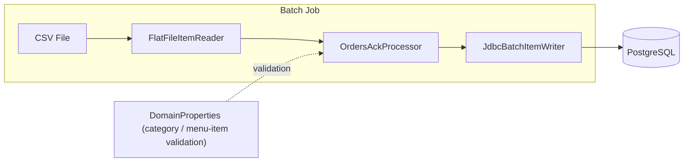

# kitchen-management-batch

Batch project for testing orders loading: a Spring Batch job reads from an external CSV file and inserts orders into the `orders_ack` table (GSG database).

## Tech Stack

- **Java 11**
- **Spring Boot 2.7.5**
- **Spring Batch** (with `@EnableBatchProcessing`)
- **Spring JDBC** + **PostgreSQL** driver
- **H2** (in-memory, for testing)

## Batch Scope

The application defines a single Spring Batch **Job** (`importOrdersJob`) composed of one **Step** (`ordersAckStep`).

### Architecture



| Component      | Class                               | Responsibility                                                                                                                                                                                   |
| -------------- | ----------------------------------- | ------------------------------------------------------------------------------------------------------------------------------------------------------------------------------------------------ |
| **Reader**     | `FlatFileItemReader<OrdersAckCsv>`  | Reads `input/orders_ack.csv`, maps each row to an `OrdersAckCsv` POJO.                                                                                                                           |
| **Processor**  | `OrdersAckProcessor`                | Validates that `categoryId` exists in the configured domain categories and, when menu-item mappings are provided, that `menuItemId` is valid. Throws `IllegalArgumentException` on invalid data. |
| **Writer**     | `JdbcBatchItemWriter<OrdersAckCsv>` | Inserts validated records into the `orders_ack` table via a parameterised SQL INSERT.                                                                                                            |
| **Chunk size** | 50                                  | Each transaction processes 50 items.                                                                                                                                                             |

### Key Classes

| Class                               | Description                                                                                                                                                                        |
| ----------------------------------- | ---------------------------------------------------------------------------------------------------------------------------------------------------------------------------------- |
| `KitchenManagementBatchApplication` | Spring Boot entry point.                                                                                                                                                           |
| `OrdersAckBatchConfig`              | Batch configuration: defines reader, writer, step and job beans. Annotated with `@EnableBatchProcessing`.                                                                          |
| `OrdersAckProcessor`                | `ItemProcessor` that validates category and menu-item IDs against `DomainProperties`.                                                                                              |
| `OrdersAckCsv`                      | POJO mapping a single CSV row (id, orderNumber, tableNumber, dates, client info, menu item, category, ack flag).                                                                   |
| `DomainProperties`                  | `@ConfigurationProperties(prefix = "app.domain")` — loads category and menu-item maps from `application.yml`. Falls back to hard-coded defaults when no categories are configured. |

### Spring Batch Metadata

The property `spring.batch.jdbc.initialize-schema: always` ensures that Spring Batch's internal metadata tables (`BATCH_JOB_INSTANCE`, `BATCH_JOB_EXECUTION`, etc.) are created automatically on the configured datasource at startup.

## Configuration

Inside `application.yml`, configure the datasource and the domain mappings for categories and menu items. The IDs represent the external ones defined in the GSG application (corresponding to `externalId` fields in the kitchen-management-server models).

```yaml
spring:
  datasource:
    url: jdbc:postgresql://localhost:5432/your_db
    username: your_user
    password: your_password
  batch:
    jdbc:
      initialize-schema: always

app:
  domain:
    categories:
      # categories {id, name} map
      1: panini
      2: piadine
      3: toast
      6: piatti unici
      8: panini special
    menu-items:
      # menu items {id, name} map (optional)
```

## Input

Place the CSV file at `input/orders_ack.csv` relative to the application working directory. The CSV columns are:

```
id, orderNumber, tableNumber, insertDate, insertTime, clientName, takeAway, orderNotes, quantity, menuItemId, menuItemName, menuItemNotes, categoryId, ack
```

## Build & Run

```bash
# Build
mvn clean package

# Run
java -jar target/kitchen-management-batch-1.0.0.jar
```

## Testing

```bash
# Run all tests
mvn test

# Run tests with coverage report (JaCoCo)
mvn verify
# Report at: target/site/jacoco/index.html
```

## Linting and Formatting

The repository uses [Spotless](https://github.com/diffplug/spotless) to keep the codebase formatted with a common standard (Google Java Standard).

```bash
# Check only

mvn spotless:check

# Format

mvn spotless:apply
```
